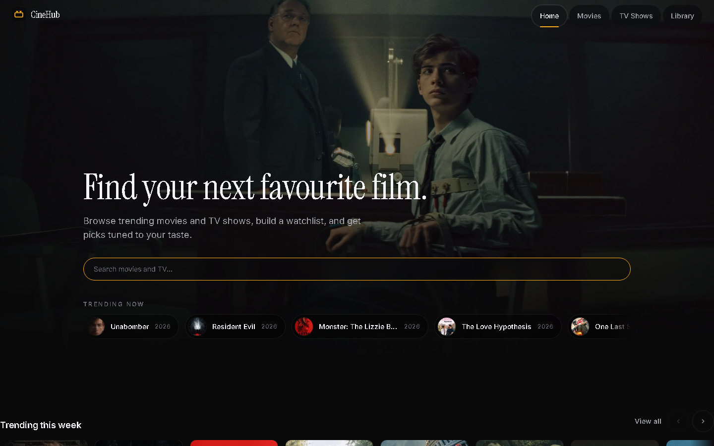
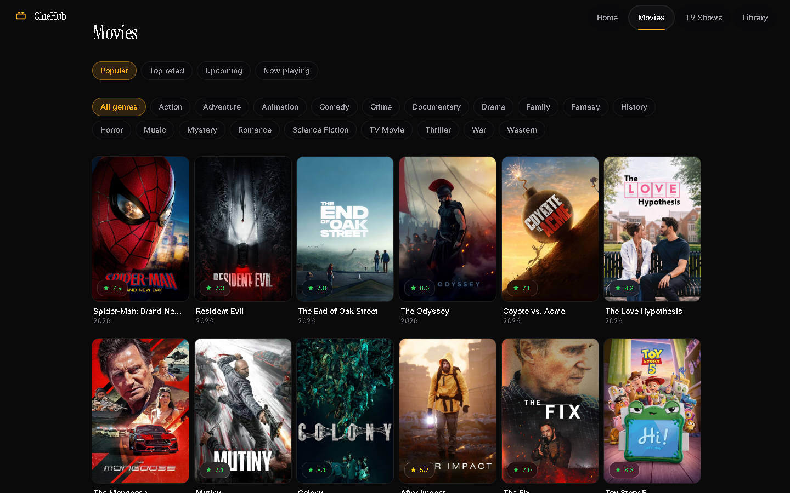
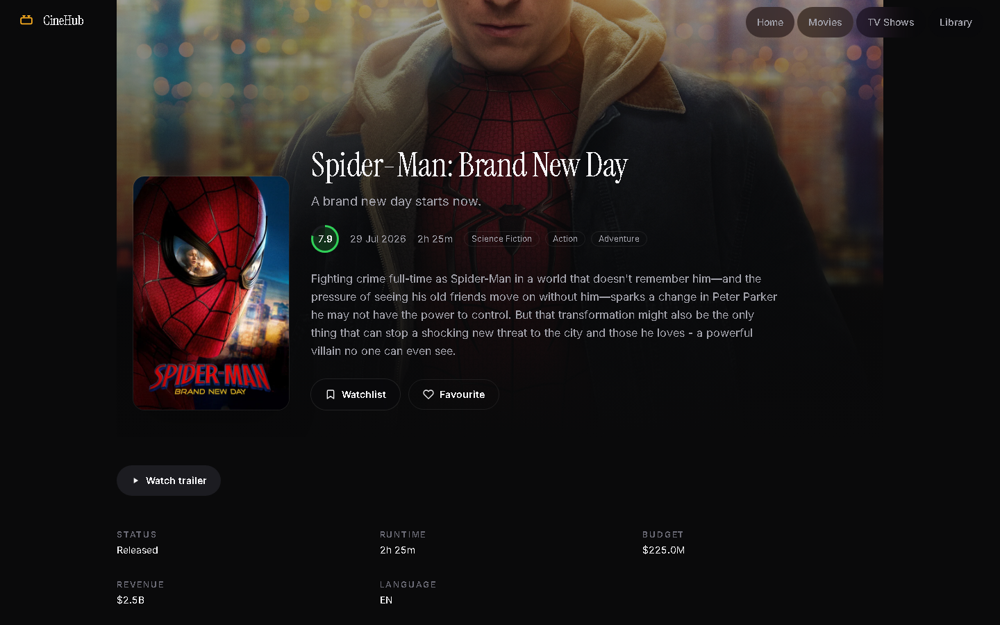
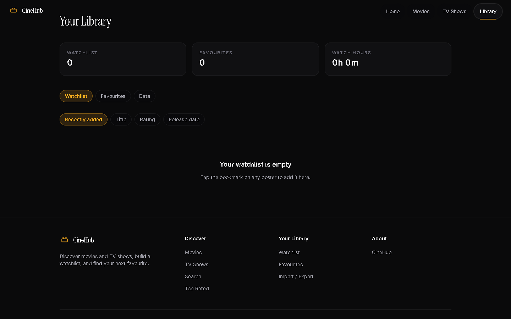

# CineHub

[](https://github.com/0x-Shadow/cinehub/actions/workflows/deploy.yml)
[](LICENSE)
[](https://react.dev)
[](https://vite.dev)

A cinematic movie & TV discovery app — trending rails, debounced search, rich
detail pages, a local-first watchlist with taste onboarding, and a one-tap
story-ready PNG export. Built with React 19, Vite 7, and Tailwind CSS 4 on top
of the TMDB API.

**Live demo:** https://0x-shadow.github.io/cinehub/

## Screenshots

| Home | Movies | Detail | Library |
| ---- | ------ | ------ | ------- |
|  |  |  |  |

## What's inside

| Path | What it is | Status |
| ---- | ---------- | ------ |
| `src/routes/` | Pages: home, movies, TV, search, detail, library, 404 | ✅ Develop here |
| `src/components/` | Presentational UI: cards, rails, hero, modals, glass system | ✅ Develop here |
| `src/api/tmdb.js` | TMDB client with LRU cache — the only network module | ✅ Develop here |
| `src/lib/` | Pure logic: formatting, filtering, library store, PNG export | ✅ Develop here |
| `src/hooks/` | Data fetching, infinite scroll, library state, reveal-on-scroll | ✅ Develop here |
| `test/` | Vitest unit tests + Playwright smoke/responsive specs | ✅ Keep green |

## Quickstart

```bash
npm install
cp .env.example .env   # add your TMDB v4 read access token
npm run dev
```

Get a token at <https://www.themoviedb.org/settings/api>.

## Checks (also run in CI)

```bash
npm run lint       # must be clean
npm test           # unit tests must pass
npm run build      # must build
npm run test:e2e   # smoke + responsive suites must pass
```

## Configuration

Copy `.env.example` and fill in your own values locally. Never commit `.env` —
the TMDB token is injected at CI build time via the `TMDB_ACCESS_TOKEN`
repository secret. If a token was ever committed to git, revoke it in the
[TMDB dashboard](https://www.themoviedb.org/settings/api) and issue a new one.

## Features

- **Discover** — trending rails, genre and sort filters, infinite scroll
- **Search** — debounced multi-type search across movies and TV
- **Detail pages** — cast, trailers, watch providers, similar and recommended titles
- **Watchlist & favourites** — persisted locally, with genre breakdown and watch-time stats
- **Taste onboarding** — pick titles you like to seed your library and watchlist
- **Share as image** — one-tap 1080×1920 story PNG with hero spotlight and glass stats
- **Dark cinematic UI** — Apple-style motion, glass surfaces, mobile-first responsive

## Contributing

PRs welcome — small and focused wins. Open an issue first for anything large.

Branch from `main`: `git checkout -b feat/short-description`
Run the checks above; update docs if behavior changes.
Open a PR (tests + screenshots where relevant).

Details: `CONTRIBUTING.md` · `CODE_OF_CONDUCT.md` · `SECURITY.md`

## License

MIT © 2026 0x-Shadow — see [LICENSE](LICENSE).

Product data courtesy of [TMDB](https://www.themoviedb.org/). This product uses
the TMDB API but is not endorsed or certified by TMDB.
