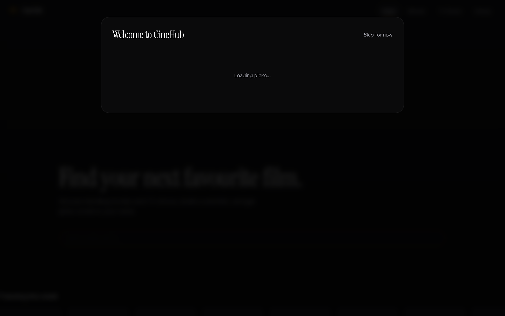
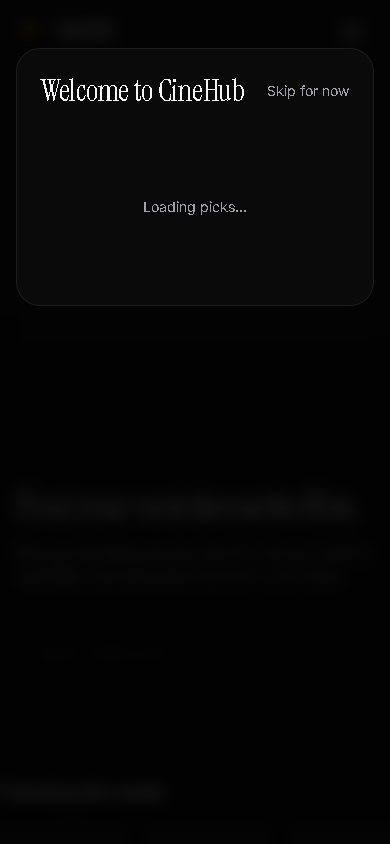

# CineHub

A cinematic movie & TV discovery app with watchlist, taste onboarding, and personalized picks.

**Live Demo:** https://0x-shadow.github.io/cinehub/

## Stack

React 19 · Vite 7 · Tailwind CSS 4 · react-router-dom 7 · TMDB API

## Features

- **Discover** — Trending movies and TV shows with infinite scroll
- **Search** — Real-time search across movies and TV with type filters
- **Detail Pages** — Backdrop heroes, cast, trailers, watch providers, similar titles
- **Watchlist & Favourites** — LocalStorage persistence with import/export
- **Taste Onboarding** — Pick a few titles to get personalized recommendations
- **Responsive** — Mobile-first design, works on all screen sizes
- **Dark Theme** — Cinematic dark UI with gold accent

## Screenshots




## Getting Started

```bash
npm install
cp .env.example .env   # add your TMDB v4 read access token
npm run dev
```

## Scripts

| Command | Purpose |
| --- | --- |
| `npm run dev` | Start the dev server |
| `npm run build` | Production build |
| `npm test` | Run unit tests |
| `npm run lint` | Lint |

## License

MIT
